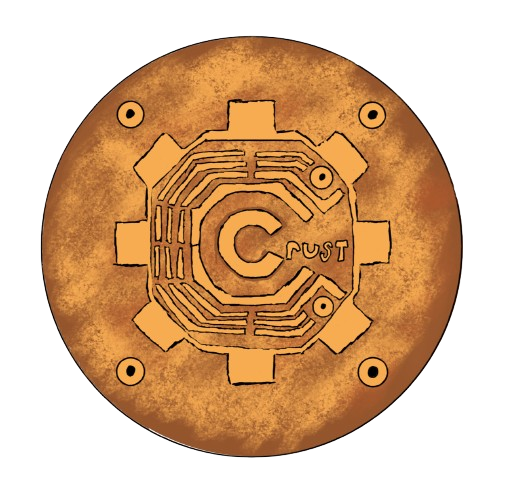

# Crust: Memory Safety Shared Object Runtime

Crust is a memory safety tool for C/C++ projects that intercepts dynamic (heap) memory allocations and provides error detection and reporting with memory dumps. It is designed to help developers catch common memory errors—such as buffer overflows, use-after-free, double free, and memory leaks—early in the development process. This project was developed for SotonHack, for the "Shapes a Secure Tomorrow" track. Since reportedly 70% of severe security vulnerabilities are memory safety related (Google and MSFT).



## Features

- ### **Redzone & Header Protection:**

  Each allocation is wrapped with a header (containing a magic canary, allocation size, and pool type) and redzones before and after the user-accessible memory. These protect against buffer overflows and underflows.

- ### **Shadow Memory Tracking:**

  A corresponding shadow record is maintained for every allocation. The shadow record includes metadata such as the pointer address, size, allocation backtrace, and status (freed or not), enabling double-free and invalid free detection.

- ### **Quarantine Mechanism:**

  Freed memory is not immediately returned to the system. Instead, it is placed into a quarantine zone with a configurable delay to catch use-after-free errors by poisoning the freed memory.

- ### **Global Validation & Signal Handling:**

  Crust++ registers a signal handler (for SIGUSR1) that triggers a global validation routine to scan active allocations and verify the integrity of headers and redzones in real time.

- ### **Robust Error Handling & Diagnostic Logging:**

  When a critical error is detected (such as a redzone corruption, header overwrite, or double free), Crust++ logs detailed error messages along with stack traces and allocation backtraces. An optional “graceful mode” can be enabled to dump additional allocation context before aborting.

- ### **Interception of Global Memory Functions:**
  Crust++ overrides global C/C++ allocation functions (`malloc`, `free`, `new`, `delete`, etc.) to ensure comprehensive coverage.

## Build Instructions

```bash
git clone https://github.com/ImArjunJ/crust.git
cd crust
```

---

```bash
mkdir build && cd build
cmake ..
cmake --build .
```

This will generate the shared object library (libcrust.so) that you can use via LD_PRELOAD.

## Usage

1. **Setting Up:**  
   Export any required environment variables before running your application:

   - `CRUST_DEBUG=1` enables detailed debug output.
   - `CRUST_GRACEFUL_MODE=1` enables graceful error reporting with additional context dumps.
   - You can also adjust other configuration options as needed within `src/CrustCommon.hpp`.

2. **Running with LD_PRELOAD:**  
   Preload the Crust shared library to intercept memory allocations:

```bash
LD_PRELOAD=./build/libcrust.so ./your_application
```

## Testing

A variety of test programs are provided in the `tests/` directory to ensure Crust++ can detect different types of memory errors and scenarios:

- **test_overflow.cpp**  
  Intentionally writes past the end of a buffer to trigger redzone corruption.

- **test_double_free.cpp**  
  Allocates and frees memory, then attempts to free it again to test double-free detection.

- **test_invalid_free.cpp**  
  Frees a pointer that was never allocated by Crust (on the heap), triggering invalid free detection.

- **test_uaf.cpp**  
  Simulates use-after-free by modifying memory after it has been freed (detected via poisoning).

- **test_stress.cpp**  
  Spawns multiple threads or loops through many allocations to stress-test Crust's performance and concurrency handling and safety.

To compile and run any of these tests, for example:

```bash
cd tests
g++ -O2 -g test_overflow.cpp -o test_overflow
LD_PRELOAD=../build/libcrust.so ./test_overflow
```

## Signal-Based Validation

Crust provides a global validation method that checks all currently allocated blocks for redzone or header corruption. By default, this validation is triggered when you send the SIGUSR1 signal to your running application like so:

```bash
kill -SIGUSR1 <pid>
```

This feature is especially useful in longer lifetime applications where you want to periodically confirm memory integrity without waiting for the program to exit or encounter a fatal error
